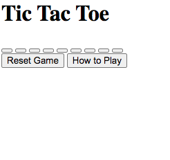
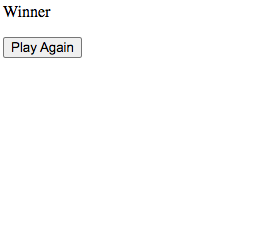
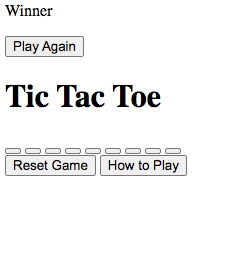

## Tic Tac Toe Game Design

This document outlines the design system for the TicTacToe game. They aim to create a visually appealing and user-friendly interface for the game

## Selector

- **selector:** \* selector applies a margin of 0 and padding of 5px to all elements to ensure consistent spacing

## Fonts

- **Primary Font**:
  - **Description**: Main font used throughout the game, applied to the `body`, and text elements
  - **Value**: `"Permanent Marker", cursive`

## Colors

- **Primary Color**:

  - **Description**: For the background gradient
  - **Value**: `linear-gradient(90deg, rgb(17, 51, 161) 0%, rgb(136, 34, 195) 100%)`

- **Text Color**:

  - **Description**: Primary color used for the text
  - **Value**: `rgb(234, 245, 171)`

- **Cell Button Background Color**:

  - **Description**: Background color for the dice buttons
  - **Value**: `#fbfbfb`

- **Cell Button Text Color**:

  - **Description**: Text color for the dice buttons
  - **Value**: `#000000`

- **Reset Button Background Color**:

  - **Description**: Background color for the reset button
  - **Value**: `rgb(255, 238, 5)`

- **Play Again Button Background Color**:

  - **Description**: Background color for the play again button
  - **Value**: `rgb(5, 255, 172)`

- **Modal Content Text Color**:
  - **Description**: Text color for the winner text in the modal
  - **Value**: `#f8f8f8`

## Layout

- **Body Layout**:

  - **Description**: Styles for the body to center content
  - **Styles**:
    ```css
    body {
      background: linear-gradient(
        90deg,
        rgb(17, 51, 161) 0%,
        rgb(136, 34, 195) 100%
      );
      text-align: center;
      display: flex;
      justify-content: center;
      font-family: "Permanent Marker", cursive;
      color: rgb(234, 245, 171);
      font-size: large;
    }
    ```

- **Game Container**:

  - **Description**: Container for the content of the game
  - **Styles**:
    ```css
    .gameContainer {
      height: 70vh;
      display: flex;
      justify-content: center;
      align-items: center;
    }
    ```

- **Cell**:
  - **Description**: Grid container for dice
  - **Styles**:
    ```css
    .cell {
      height: 60vmin;
      width: 60vmin;
      display: flex;
      flex-wrap: wrap;
      justify-content: center;
      align-items: center;
      gap: 1.5vmin;
    }
    ```

## Buttons

- **Cell Button**:

  - **Description**: Styles for dice buttons
  - **Styles**:
    ```css
    .cellButton {
      height: 18vmin;
      width: 18vmin;
      border-radius: 1rem;
      border: none;
      box-shadow: 0 0 1rem rgba(0, 0, 0, 0.5);
      font-size: 8vmin;
      cursor: pointer;
      font-family: "Permanent Marker", cursive;
      background-color: #fbfbfb;
      color: #000000;
    }
    ```

- **Reset Button**:

  - **Description**: Styles for the reset button
  - **Styles**:
    ```css
    #resetBtn {
      padding: 1rem;
      font-size: 1.25rem;
      background-color: rgb(255, 238, 5);
      color: #000000;
      border-radius: 1rem;
      border: none;
    }
    ```

- **Play Again Button**:

  - **Description**: Styles for the play again button
  - **Styles**:
    ```css
    #playAgainBtn {
      padding: 1rem;
      font-size: 1.1rem;
      background-color: rgb(5, 255, 172);
      color: #000000;
      border-radius: 1rem;
      border: none;
    }
    ```

- **How to Play Button**:
  - **Description**: Styles for the how to play button. It specifies the rules of the game.
  - **Styles**:
    ```css
    #howtoplayBtn {
      padding: 1rem;
      font-size: 1.1rem;
      background-color: rgb(5, 255, 172);
      color: #000000;
      border-radius: 1rem;
      border: none;
    }
    ```
- **Login Button**

  - **Description**: Styles for the login button in the authentication container.
  - **Styles**:

  ```css
  form button {
    padding: 10px;
    border-radius: 5px;
    border: none;
    cursor: pointer;
    background-color: rgb(5, 255, 172);
    color: #000000;
    transition: background-color 0.3s ease;
  }

  form button:hover {
    background-color: rgb(0, 204, 153);
  }
  ```

- **Register Button**

  - **Description**: Styles for the register button in the authentication container.
  - **Styles**:

  ```css
  form button {
    padding: 10px;
    border-radius: 5px;
    border: none;
    cursor: pointer;
    background-color: rgb(5, 255, 172);
    color: #000000;
    transition: background-color 0.3s ease;
  }

  form button:hover {
    background-color: rgb(0, 204, 153);
  }
  ```

## Miscellaneous

- **Modal Content**:

  - **Description**: Styles for the tile map of the game.
  - **Styles**:
    ```css
    .modalContent {
      height: 100vmin;
      display: flex;
      justify-content: center;
      align-items: center;
      flex-direction: column;
      gap: 4rem;
    }
    ```

- **Winner Text**:

  - **Description**: Styles for the text for the winner of the game
  - **Styles**:
    ```css
    #winnerText {
      font-size: 2rem;
      font-family: "Permanent Marker", cursive;
      color: #f8f8f8;
    }
    ```

- **Hide Class**:

  - **Description**: Class for hiding the winner of the game
  - **Styles**:
    ```css
    .hide {
      display: none;
    }F
    ```

- **Rules Section**:
  - **Description**: Styles for the rules section
  - **Styles**:
    ```css
    #rules {
      text-align: center;
      margin: auto;
    }
    ```
- **Leaderboard Section**:

  - **Description**:

  1. Styles for the leaderboard section
  2. Displays the number of wins for each player.
  3. Updates dynamically as players win games.

  - **Styles**:

    ```css
    #leaderboard {
      margin-top: 2rem;
      text-align: center;
    }

    #leaderboard h2 {
      font-size: 1.5rem;
    }

    #leaderboardList li {
      font-size: 1.25rem;
      margin: 0.5rem 0;
      list-style: none;
      padding: 0;
      color: #fbfbfb;
    }
    ```

- **Authentication Container**:

  - **Description**:

  1. The Auth Container is a dedicated section within the Tic Tac Toe game interface that provides functionality for user authentication.
  2. It includes both registration and login forms, enabling users to create an account or log in to an existing one.

  - **Styles**:

  ```css
  .auth-container {
    display: flex;
    flex-direction: column;
    align-items: center;
    margin-top: 2rem;
  }

  .auth-container h2 {
    font-size: 1.5rem;
    margin-bottom: 1rem;
    color: rgb(234, 245, 171);
  }

  .auth-container form {
    display: flex;
    flex-direction: column;
    align-items: center;
    width: 100%;
    max-width: 400px;
    padding: 1rem;
    background-color: #fbfbfb;
    border-radius: 1rem;
    box-shadow: 0 0 1rem rgba(0, 0, 0, 0.5);
  }

  .auth-container form label {
    margin-bottom: 0.5rem;
    font-size: 1rem;
    color: #000000;
  }

  .auth-container form input {
    width: 100%;
    padding: 0.5rem;
    margin-bottom: 1rem;
    border-radius: 0.5rem;
    border: 1px solid #ccc;
  }

  .auth-container form button {
    padding: 0.5rem 1rem;
    font-size: 1rem;
    border: none;
    border-radius: 1rem;
    background-color: rgb(5, 255, 172);
    color: #000000;
    cursor: pointer;
  }
  ```
- **Mobile Styles**:
  - **Description**: Styles for mobile view, ensuring proper display on smaller screens.
  - **Styles**:
  ```css
  @media (max-width: 600px) {
    .auth-container {
      flex-direction: column;
      align-items: center;
    }
  
    #registrationSection, #loginSection {
      max-width: 100%;
      margin-bottom: 20px;
    }
  }
  ```


## Components

### Header


### Main



### ModalContent



### Body


```
